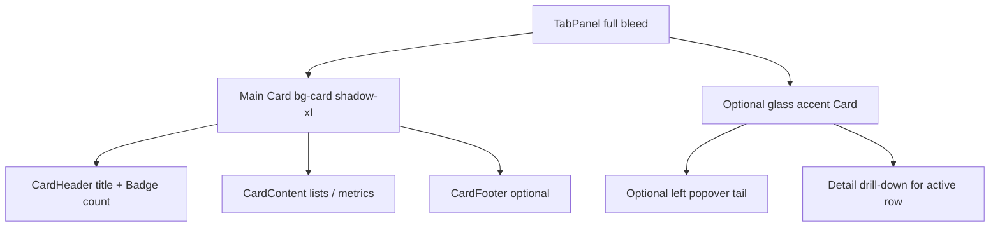

# Landing feature visuals (wiki)

Guide for building right-panel mocks in the **Features** section on the landing page. Use this in new threads so Event Intelligence, Reach the Right People, and Community Memory match the established look.

**Reference implementation:** `app/modules/landing/components/feature-visual-member-memory.tsx`

---

## 1. Purpose and scope

- **Marketing mocks only** — no Supabase, no real data, static UI (no animation unless explicitly requested).
- **One component per feature tab** — the parent only switches which visual to render.
- **Align with copy** — each visual should reinforce the active tab’s title and description in `featuresShowcase.items.*` (`app/locales/en/landing.json`, `app/locales/az/landing.json`).
- **No screenshots** — build with shadcn primitives and mock data, same as Member Memory.

---

## 2. File layout and wiring

| Piece | Location |
|-------|----------|
| Tab shell + tablist | `app/modules/landing/components/landing-features.tsx` |
| Per-feature visual | `app/modules/landing/components/feature-visual-<kebab-name>.tsx` |
| User-visible copy | `featuresShowcase.items.<featureKey>.visual.*` in `en` + `az` landing.json |
| Static assets | `public/landing/features/` (local SVG/PNG only) |

### Wiring in `landing-features.tsx`

Add one import and one branch per visual:

```tsx
{FEATURE_KEYS[activeIndex] === "eventIntelligence" ? (
  <FeatureVisualEventIntelligence />
) : FEATURE_KEYS[activeIndex] === "memberMemory" ? (
  <FeatureVisualMemberMemory />
) : (
  // placeholder for tabs not yet built
)}
```

### Tab panel shell

- Container: `min-h-[280px] lg:min-h-[500px]`, `rounded-[14px]`, transparent wrapper.
- **Visual fills the panel** — no peach/orange wash behind the main card.
- Remove placeholder blob layers when that tab’s visual ships.

---

## 3. Composition pattern



### Main card

- `Card` with `flex h-full w-full flex-col`, `rounded-[14px]`, `bg-card`, `border-border/60`, `shadow-xl`.
- Header: title (`text-lg font-semibold text-foreground`) + optional count `Badge` (`bg-primary/10 text-primary`).
- Sub-status row: small primary dot + `text-xs text-muted-foreground` (e.g. “Auto-synced from your events”).
- Body: `flex-1` content — lists use `justify-around` or similar so rows breathe in tall panels.

### Optional floating accent card

- Smaller `Card`, `absolute` top-right, slight `rotate-[3deg]`.
- Glass: `bg-card/60`, `backdrop-blur-sm`, `backdrop-saturate-50`, `border-primary/20`, `shadow-md shadow-primary/20`.
- `overflow-visible` on the card so the tail is not clipped.

### Popover tail (opened from a row)

- Left-edge diamond: `absolute -left-[7px]`, `size-3 rotate-45`, `border-l border-b border-primary/20`, same glass background/blur as accent card.
- Position vertically near the **active** list row (`top-*` tuned per layout).

### Active list row

When one row “owns” the accent card:

```txt
-mx-3 rounded-lg bg-primary/5 px-3 py-3 ring-1 ring-inset ring-primary/15
```

Inactive rows: `border-b border-border/60` between items.

---

## 4. Color and typography

### Color rules (strict)

- **Semantic tokens only:** `primary`, `primary-foreground`, `card`, `foreground`, `muted-foreground`, `border`.
- **Opacity on primary/card:** `/5`, `/10`, `/15`, `/20`, `/30`, `/40`, `/60` — e.g. `bg-primary/10`, `border-primary/30`, `ring-primary/15`.
- **Do not use raw hex** in these components (no `#FF6D23`, `#141414`, etc.).
- Avatar fallbacks: `bg-gradient-to-br from-primary to-primary/80` (vary stops per row), `text-primary-foreground`.

### Typography

| Role | Classes |
|------|---------|
| Card title | `text-lg font-semibold text-foreground` |
| Secondary | `text-xs text-muted-foreground` |
| Meta — baseline | `text-[10px] text-muted-foreground` + icon `text-primary` |
| Meta — emphasis | `text-[10px] font-medium text-primary` + icon |
| Micro label | `text-[9px] uppercase tracking-wide text-primary` |
| Meta separator | `·` with `text-muted-foreground/50` |

**Do not** put chip backgrounds/borders on inline meta lines (user preference). Use icon + color only.

### Icons

- Import from `lucide-react`, typically `size-3`, `aria-hidden` when decorative.
- Centralize mapping in a `Record<key, { i18nKey, Icon }>` (see `AFFINITY_CONFIG` in Member Memory).

### shadcn (`~/shared/components/ui/`)

- `Card`, `CardHeader`, `CardTitle`, `CardContent`, `CardFooter`
- `Avatar`, `AvatarImage`, `AvatarFallback`
- `Badge` — header totals (`variant="secondary"` + `bg-primary/10 text-primary`) or row tags (`variant="outline"` + `border-primary/30 text-primary`)

---

## 5. Content and copy rules

### Names and data

- **Generic international names** — Alex, Sam, Maya, Jordan (not region-specific).
- **Mock numbers and labels** in component constants (`ROSTER`, `TIMELINE`, etc.).
- **Translatable UI strings** under `featuresShowcase.items.<featureKey>.visual` in both `en` and `az`.

### i18n key pattern

```json
"featuresShowcase": {
  "items": {
    "eventIntelligence": {
      "title": "...",
      "description": "...",
      "visual": {
        "title": "...",
        "someMetric": "..."
      }
    }
  }
}
```

In the component:

```tsx
const prefix = "featuresShowcase.items.eventIntelligence.visual";
t(`${prefix}.title`);
```

### Member Memory patterns (canonical)

- Roster meta: **Joined N events** (calendar icon, muted text) · **affinity** (format or topic icon, primary text). On **mobile**, stack joined events above affinity (no middot); on **`lg+`**, use inline `Joined · affinity` with icons (no chip backgrounds).
- Affinity examples: “Loves hackathons”, “Into AI events” — inferred preference, not “Returned 4x”.
- Floating card: **Registered → Attended → Returned** timeline for the active member only.
- Avatars: `public/landing/features/feature-avatar-1.svg` … `feature-avatar-4.svg` (avatar 4 = Maya).

---

## 6. Storyboards for remaining tabs

Each tab should feel distinct but use the same **main + optional glass accent + optional active row** grammar.

| Tab key | Left copy theme | Suggested mock |
|---------|-----------------|----------------|
| `eventIntelligence` | Which events worked, who showed up, repeats | **Main:** event list with attendance indicators (bars or checkmarks). **Accent:** single-event insight card (show rate %, repeat rate). |
| `reachTheRightPeople` | Filter by interest or attendance | **Main:** audience segments (All / Hackathon fans / Webinar regulars). **Accent:** announcement preview (“Sending to 42 members”). |
| `communityMemory` | Co-organizer sees full history on day one | **Main:** activity feed or handoff summary. **Accent:** “New co-organizer” card with preserved context / mini timeline. |

**Avoid** cloning the Member Memory roster + timeline for every tab.

---

## 7. Checklist (new visual)

- [ ] New file `app/modules/landing/components/feature-visual-<name>.tsx`
- [ ] `landing-features.tsx`: one import + one `FEATURE_KEYS[activeIndex]` branch
- [ ] `visual` block in `app/locales/en/landing.json` and `app/locales/az/landing.json`
- [ ] Semantic colors only; no external avatar/image APIs
- [ ] New assets under `public/landing/features/` if needed
- [ ] Visual fills tabpanel; remove peach placeholder for that tab
- [ ] Lint clean on touched files

---

## 8. Anti-patterns

- Putting mock UI directly in `landing-features.tsx`
- Duplicating Member Memory’s exact roster + timeline on other tabs
- Chip-style meta rows (background + border on “Joined / affinity” text)
- Full-panel orange/peach backgrounds behind the main card
- Hardcoded hex colors instead of `primary` / `muted-foreground` tokens
- Exporting component-local types for use in hooks or routes (keep types in module `model/` if shared)

---

## 9. Quick prompt for agents

Copy into a new thread:

> Build the **{TabName}** feature visual for the landing Features section per `docs/landing-feature-visuals.md`. Reference `feature-visual-member-memory.tsx`. One new component file, wire in `landing-features.tsx`, add `visual.*` i18n en+az. Full-bleed main card, semantic primary tokens only, optional glass accent with left tail. Mock data only, generic names, local assets in `public/landing/features/`.
