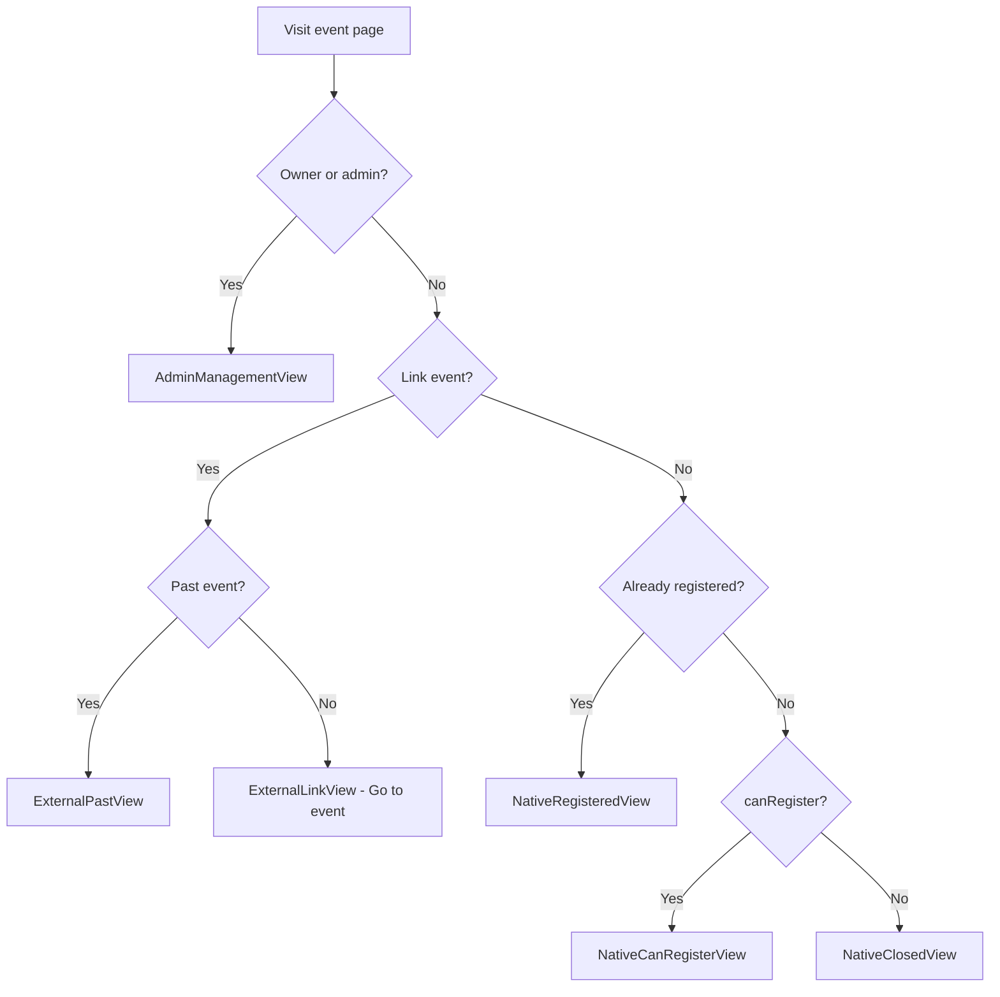
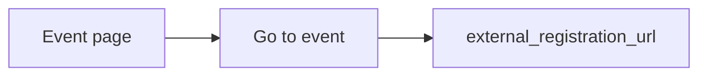

# Event flows (current) — temporary reference

> **Status:** Temporary doc reflecting codebase as of 02-07-2026 (after link-event simplification).  
> Replace or merge into permanent docs when ready.

---

## Overview

Luhive supports **two event types**, distinguished by `events.registration_type`:

| Type | `registration_type` | Create route | What Luhive does |
|------|---------------------|--------------|------------------|
| **Native (Luhive Event)** | `null` / not `"external"` | `/dashboard/:slug/events/create` | Full registration, emails, approval, QR check-in, reminders, attenders |
| **Link event** | `"external"` | `/dashboard/:slug/events/create-external` | Event card only — visitors click **Go to event** and leave Luhive |

There is **no** subscribe/registration tracking on link events anymore. Native registration is unchanged.

---

## 1. Event creation (dashboard)

### Native — Luhive Event

```
Dashboard → Events → Create → "Luhive Event"
  → /dashboard/:slug/events/create
  → event-form.tsx (full form)
  → registration_type: null (default)
  → capacity, deadline, custom questions, reminders, approval, etc.
```

### Link event

```
Dashboard → Events → Create → "Link Event"
  → /dashboard/:slug/events/create-external
  → external-event-form.tsx
  → registration_type: 'external'
```

**Link event form fields:**

| Field | Stored as |
|-------|-----------|
| Event Page URL * | `external_registration_url` (+ auto `external_platform`) |
| Event Name * | `title` |
| Event Location | Google Places → `location_name`, `location_address`, `location_lat`, `location_lng`, `location_place_id` |
| Host | Display only → community name (not stored) |
| Event Time | `start_time`, `end_time`, `timezone` |
| Cover | `cover_url` |

Edit: `/dashboard/:slug/events/:eventId/edit-external` (redirects to native edit if not external).

---

## 2. Public event page entry

**URL:** `/c/:communitySlug/:eventSlug`

```
GET /c/:slug/:eventSlug
  → event-detail-loader.server.ts
  → resolvePublicEvent() (host or co-host, published only)
  → Count approved registrations (native capacity display)
  → canRegister = published AND before deadline AND under capacity
  → isExternalEvent = registration_type === 'external'
  → For link events: skip user registration lookup
  → EventDetail + EventRegistrationCard
```

On mount: client posts `intent=track_visit` → `event_visits` (analytics).

---

## 3. Public UI decision tree



### Link event — visitor UX

- Same page for guest and logged-in user (no auth, no subscribe).
- Shows: cover, title, date/time, location (map if Places data), host = **community name**.
- CTA: **Go to event** → `external_registration_url` (new tab).
- Badge: **Link event**.

### Native event — registration closed when

- Event ended (`isPastEvent`)
- Full capacity (`registrationCount >= capacity`)
- Past registration deadline
- Event not published

---

## 4. Native registration flow

Native registration **always requires a Luhive account** (guests via OTP signup).

### 4a. Logged-in, no custom questions

```
Register button → POST intent=register (event-detail-action)
  → event_registrations insert (rsvp_status: going)
  → approval_status: pending | approved (from is_approve_required)
  → checkin_token if approved immediately
  → POST /api/events/registration-confirmation (email)
  → If approved: POST /api/events/collaboration-notification (admins)
```

### 4b. Logged-in, custom questions

```
Register → CustomQuestionsForm modal
  → POST register + custom_answers JSON
  → validateCustomAnswers() → same insert path as 4a
```

### 4c. Guest — EventRsvpModal

```
Email → POST /signup (intent=check-email)
  ├─ Existing user → OTP (/auth/verify-otp)
  └─ New user → name/surname → event-rsvp-signup → OTP

OTP verify (eventId passed when no custom questions for existing user):
  → verify-otp-action inserts registration + optional community join

Existing user + custom questions:
  OTP (auth only, no eventId) → questions → POST register on event page

New user + custom questions:
  questions → signup → OTP with customAnswers → register in verify-otp
```

Alternative: **Login** link stores `post_login_return_to` → `/login`.

### 4d. After registration — states

| `approval_status` | UI | QR check-in |
|-------------------|-----|-------------|
| `pending` | Amber pending banner | No |
| `approved` | Green registered + QR | Yes |
| `rejected` | Red rejected banner | No |

Cancel: `intent=unregister` (native only).

---

## 5. Link event flow (no Luhive registration)



**Server:** `register`, `subscribe`, `anonymous-subscribe` intents removed or blocked for external events.

**Dashboard:** Attenders page shows empty state — link events don't track attendees.

**Schedule edits:** No subscriber emails (`api-event-schedule-update` skips external).

---

## 6. Admin — approval & attenders (native only)

```
Dashboard → Attenders (?eventId=...)
  → Blocked for link events (empty state)

Native pending registration:
  Admin approve/reject → POST /api/events/update-registration-status
    → approve: set checkin_token, send status email
    → reject: status email
```

---

## 7. Check-in (native, approved only)

```
Registrant: QR from checkin_token on event page
Scanner: /dashboard/:slug/events/:eventId/scanner
  → POST /api/events/check-in
  → is_attended, attended_at on event_registrations
```

---

## 8. Reminders (native only)

Configured on native event create/edit → `event_reminders.reminder_times[]`.

External cron (e.g. cron-job.org every 15 min):

```json
POST /api/events/send-reminders
{ "reminderTime": "5-days"|"3-days"|"1-day"|"5-hours"|"3-hours"|"1-hour", "secret": "<CRON_SECRET>" }
```

Recipients: `approval_status=approved`, `rsvp_status=going` (logged-in + legacy anonymous rows). Link events typically have no such rows going forward.

---

## 9. Emails (native registration)

| Trigger | Email |
|---------|--------|
| Register (approved) | Confirmation + ICS + QR |
| Register (pending) | Registration request |
| Register (approved) | Admin notification (host + co-hosts) |
| Admin approve/reject | Status update |
| Schedule change (native) | Schedule update to registrants |
| Reminder cron | Event reminder |

**Removed:** Subscription confirmation email (link events).

---

## 10. Co-hosting

- Public URL works from host or co-host community slug.
- Native register: `registration_source_community_id` = page community (event-detail-action) or host (verify-otp path).
- Link events: no registration attribution.

---

## 11. Key files

| Area | Path |
|------|------|
| Public route | `app/routes/web/event-detail.tsx` |
| Loader | `app/modules/events/server/event-detail-loader.server.ts` |
| Actions | `app/modules/events/server/event-detail-action.server.ts` |
| Registration UI | `app/modules/events/components/event-detail/event-registration-card.tsx` |
| Link CTA | `app/modules/events/components/event-detail/registration-states/external-link-view.tsx` |
| RSVP modal | `app/modules/events/components/registration/event-rsvp-modal.tsx` |
| OTP + auto-register | `app/modules/auth/server/verify-otp-action.server.ts` |
| Native form | `app/modules/events/components/event-form/event-form.tsx` |
| Link form | `app/modules/events/components/event-form/external-event-form.tsx` |
| Location (Google) | `app/modules/events/utils/google-maps.ts`, `physical-location-field.tsx` |
| Reminders cron | `app/modules/events/server/api-send-reminders.server.tsx` |
| Attenders | `app/routes/dashboard/attenders.tsx` |

---

## 12. Known gaps / legacy

- **No server-side capacity/deadline re-check** on `register` / verify-otp (UI gating only).
- **No waitlist** — full capacity = closed UI.
- **Legacy** `event_registrations` from old link-event subscribers may exist in DB; no UI.
- **`registration_type: "both"`** in types — not implemented.
- **`database.types.ts`** may lag migration columns (UTM, IP, etc.).

---

## 13. Quick test matrix

| Scenario | Expected |
|----------|----------|
| Create link event + publish | Badge "Link event", public **Go to event** works |
| Link event, guest vs logged-in | Identical UX, no auth |
| Native register (logged-in) | Row in `event_registrations`, confirmation email |
| Native guest RSVP | OTP → account + registration |
| Link event attenders page | Empty state message |
| Native approval required | Pending → admin approve → QR + email |
| Reminder cron | Only native approved+going registrants |
